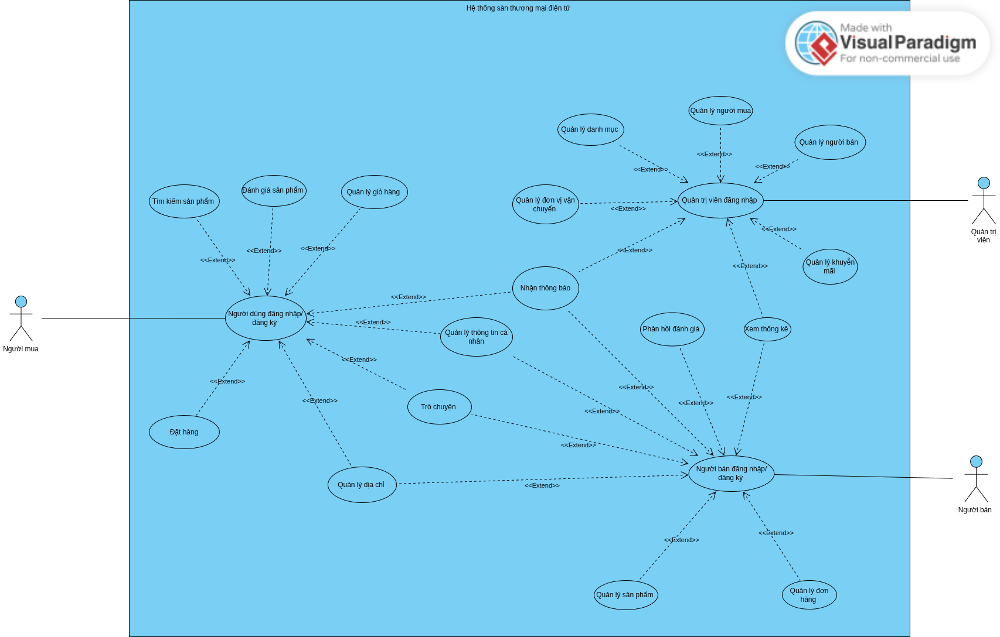

# 🛒 FastBuy - Ecommerce Website

> Một nền tảng thương mại điện tử hiện đại, nơi người dùng có thể tìm kiếm, mua sắm và quản lý đơn hàng trực tuyến một cách dễ dàng và thuận tiện.
> 
---
## Thành viên & Phân công nhiệm vụ

| STT | Họ và tên            | Nhiệm vụ đảm nhận                   |
|:---:|:---------------------|:------------------------------------|
|  1  | **Hoàng Đình Duy**   | Trưởng nhóm, Backend Seller - Admin |
|  2  | **Nguyễn Thị Hòa**   | Backend Buyer                       |
|  3  | **Lê Trang Thu**     | Frontend Buyer                      |
| 4   | **Đinh Thị Kiều Na** | Frontend Seller - Admin             |

---

## 🚀 Tính năng chính

Hệ thống cung cấp đầy đủ các tính năng cần thiết cho một sàn thương mại điện tử:

* **🔍 Tìm kiếm và Lọc:** Hỗ trợ tìm kiếm sản phẩm thông minh theo tên, danh mục hoặc khoảng giá.
* **🛒 Giỏ hàng:** Thêm, sửa, xóa sản phẩm và xem tổng tiền tạm tính trước khi thanh toán.
* **💳 Đặt hàng:** Hỗ trợ đặt hàng tính tổng đơn hàng
* **📦 Quản lý đơn hàng:** Theo dõi trạng thái đơn hàng (Đang xử lý, Đang giao, Đã giao, Hủy).
* **👤 Tài khoản người dùng:** Đăng ký, đăng nhập (JWT), cập nhật thông tin cá nhân và xem lịch sử mua hàng.

---

## 🗺 Sơ đồ Use Case

Dưới đây là sơ đồ tổng quan về các chức năng và tương tác của người dùng với hệ thống:

---

## 🛠 Công nghệ sử dụng

Dự án được xây dựng theo mô hình Client-Server với các công nghệ tiên tiến:

### Frontend
- HTML
- CSS/SCSS 
- JavaScript
- React

### Backend
-   **Framework:** FastAPI (Python)
-   **Database:** PostgreSQL, MongoDB, Redis
-   **Task:** Celery
-   **Giao thức:** Websocket 

### Deployment 
- **Cloud Server**: AWS EC2 (Amazon Linux 2023).
- **Reverse Proxy**: Nginx.
- **Process Manager**: Docker & Docker Compose (hoặc Supervisor/Systemd nếu bạn chạy trực tiếp).
- **SSL/Security**: Let's Encrypt (HTTPS).

---
## 🔗 Danh sách đường dẫn truy cập

Dưới đây là các liên kết quan trọng để truy cập vào hệ thống đã được triển khai trên AWS EC2:

| Kênh truy cập          | Đường dẫn (URL)                                                     | Mô tả                               |
|:-----------------------|:--------------------------------------------------------------------|:------------------------------------|
| **🏠 Website chính**   | [https://www.fastbuy.io.vn](https://www.fastbuy.io.vn)              | Trang dành cho khách hàng mua sắm . |
| **🎨 Trang người bán** | [https://seller.fastbuy.io.vn](https://seller.fastbuy.io.vn)        | Trang dành cho người bán            |
| **🗃️ Trang admin**    | [https://admin.fastbuy.io.vn](https://seller.fastbuy.io.vn)                                     | Trang dành cho admin                |

---
## 🔐 Tài khoản trải nghiệm

Sử dụng các tài khoản dưới đây để trải nghiệm đầy đủ tính năng của website

**Chú ý:** Đăng nhập tại 3 cửa sổ trình duyệt khác nhau để tránh lỗi xác thực

| Vai trò        | Tên đăng nhập / Email | Mật khẩu   | Ghi chú                            |
|:---------------|:----------------------|:-----------|:-----------------------------------|
| **Khách hàng** | `myname@example.com`  | `test123`  | Hoặc sử dụng đăng nhập bằng google |
| **Admin**      | `admin1@example.com`  | `admin1`   |                                    |
| **Seller**     | `joymall@example.com` | `shop1234` |                                    |

---

## 📚 Tài liệu tham khảo
-   **API Documentation:** [Xem tại đây](https://documenter.getpostman.com/view/51215929/2sBXVcksnM)
